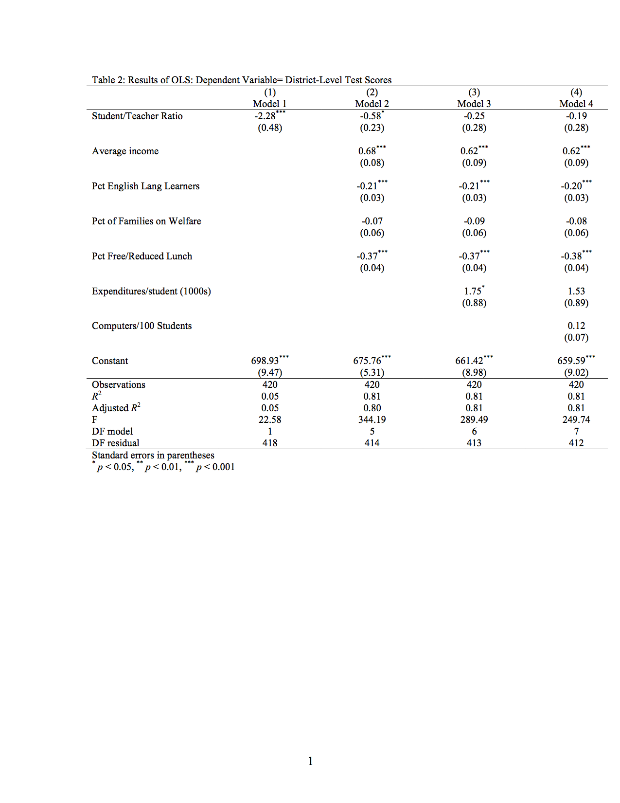
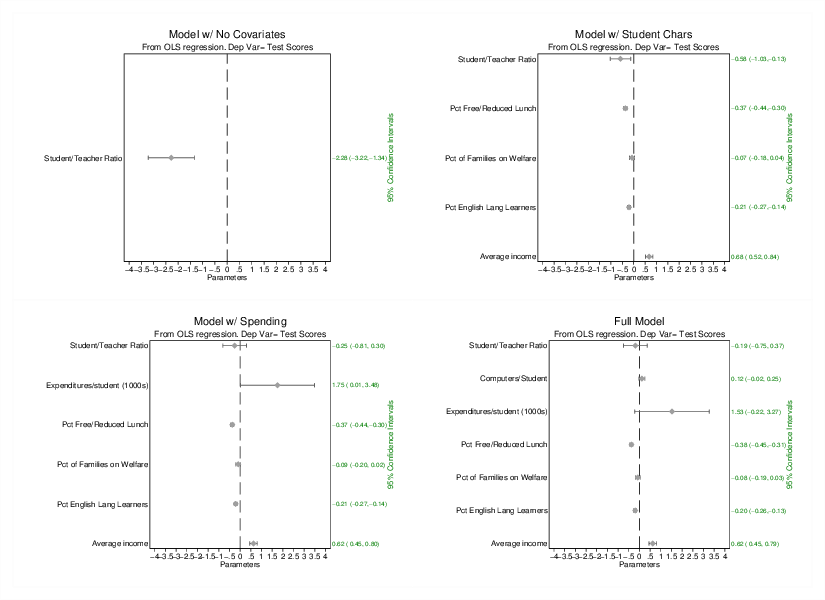

Reporting Regression in Stata
================
LPO 9952 | Spring 2017

Reporting regression results should be motivated by the questions the reader would ask:

-   What steps did the analyst take to specify the models?

-   What results led the analyst to come to the conclusions they did regarding the impact of certain variables on the dependent variable?

-   What results provided information about model fit?

-   Is there reason to doubt some of the conclusions that the analysts draws?

You can’t report everything you do in the course of your analysis—it would be impractical and wouldn’t help to clarify your description of the analysis. However, you should strive to make all of the information you use to describe your conclusions in the text available to the reader. It’s of crucial importance that you report not just the analyses that support your pet hypoth- esis, but rather that you provide the reader enough information to judge the level of evidence that supports your conclusions.

Today we'll be using the `caschool.dta` file. The code below checks to see if it's on your computer, and if it's not, downloads it for you. This is a good workflow to use for online data.

    . capture confirm file caschool.dta

    . if _rc==601{
    . use http://fmwww.bc.edu/ec-p/data/stockwatson/caschool.dta
    . save caschool, replace
    . } /* End Download Section */

    . use caschool, clear

Next, I label and format variables appropriately.

    > 
    . gen expn_stu_k=expn_stu/1000

    . gen comp_stu_h=comp_stu*100

    . /*Label variables*/
    . label variable testsc "Combined test scores"

    . label variable avginc "Average income"

    . label variable el_pct "Pct English Lang Learners"

    . label variable calw_pct "Pct of Families on Welfare"

    . label variable meal_pct "Pct Free/Reduced Lunch"

    . label variable str "Student/Teacher Ratio"

    . label variable expn_stu "Expenditures/student"

    . label variable expn_stu_k "Expenditures/student (1000s)"

    . label variable comp_stu "Computers/Student"

    . label variable comp_stu_h "Computers/100 Students"

Using locals to create conceptual groupings of variables is an important step in improving your workflow.

    . local y testscr

    . local students avginc el_pct calw_pct meal_pct

    . local teacher str

    . local finance expn_stu_k

    . local computers comp_stu_h

    . estimates clear

Reporting Descriptive Statistics
--------------------------------

There are many journals that discourage including tables of descriptive statistics. Others still require them. In either case, you should be quite familiar with your data, and it’s a good idea to have a table of descriptive statistics. Luckily this is very simple using the estpost and esttab commands. The commands below will create a nicely formatted table.

    . eststo descriptives: estpost tabstat `y' `students' `teacher' `finance', ///
    >     statistics(mean sd) ///
    >     columns(statistics) ///
    >     listwise 

    Summary statistics: mean sd
         for variables: testscr avginc el_pct calw_pct meal_pct str expn_stu_k

                 |   e(mean)      e(sd) 
    -------------+----------------------
         testscr |  654.1565   19.05335 
          avginc |  15.31659    7.22589 
          el_pct |  15.76816   18.28593 
        calw_pct |  13.24604   11.45482 
        meal_pct |  44.70524   27.12338 
             str |  19.64043   1.891812 
      expn_stu_k |  5.312408   .6339371 

    .     
    . esttab descriptives using esttab_means.`tab_type' , ///
    >     main(mean) ///
    >     aux(sd) ///
    >     nostar ///
    >     nonote ///
    >     label ///
    >     nonumber ///
    >     replace 
    (output written to esttab_means.rtf)

    .         

Reporting Conditional Means
---------------------------

As we've discussed, regression is just a fancy way of doing conditional means. Many times it’s quite helpful to explore the data using conditional means in order to demonstrate that the patterns you’re seeing in the regression results are there even in a simpler format. For instance, let’s take a look at the relationship between math scores and student-teacher ratio in several different district contexts. The first thing we need to do is to generate categorical variables for class size. We’ll do this by using the sum command. Then we will label the generated variable, and summarize the outcome(test scores) and other covariates as a function of class size.

    . /* Three groups: small class size, middle, and large */
    . sum str, detail 

                        Student/Teacher Ratio
    -------------------------------------------------------------
          Percentiles      Smallest
     1%     15.13898             14
     5%     16.41658       14.20176
    10%     17.34573       14.54214       Obs                 420
    25%     18.58179       14.70588       Sum of Wgt.         420

    50%     19.72321                      Mean           19.64043
                            Largest       Std. Dev.      1.891812
    75%     20.87183          24.95
    90%     21.87561       25.05263       Variance       3.578952
    95%     22.64514       25.78512       Skewness      -.0253655
    99%     24.88889           25.8       Kurtosis       3.609597

    .   
    . gen class_size=str<=r(p25)

    . replace class_size=2 if str>r(p25)&str<=r(p75)
    (210 real changes made)

    . replace class_size=3 if str>r(p75)
    (105 real changes made)

    . replace class_size=. if str==.
    (0 real changes made)

    . label define sizes 1 "Small Class Size" 2 "Medium Class Size"  3 "Large Class Size"

    . label values class_size sizes

    . /*Summary table */
    . eststo descriptives_size: estpost tabstat `y' `students' `teacher' `finance', ///
    >     by(class_size) ///
    >     statistics(mean sd) ///
    >     columns(statistics) ///
    >     listwise 

    Summary statistics: mean sd
         for variables: testscr avginc el_pct calw_pct meal_pct str expn_stu_k
      by categories of: class_size

      class_size |   e(mean)      e(sd) 
    -------------+----------------------
    Small Clas~e |                      
         testscr |  659.9914   21.30227 
          avginc |  17.80907   10.78676 
          el_pct |  11.23263   16.98024 
        calw_pct |  13.19018   12.09932 
        meal_pct |  40.20112   29.78182 
             str |  17.22926   1.069095 
      expn_stu_k |  5.844176   .7127741 
    -------------+----------------------
    Medium Cla~e |                      
         testscr |  654.1148   17.86415 
          avginc |  14.85916   5.688771 
          el_pct |  15.42214   17.61338 
        calw_pct |  13.20786   11.57226 
        meal_pct |  44.02096   25.93847 
             str |  19.68908   .6305783 
      expn_stu_k |  5.247282   .4960094 
    -------------+----------------------
    Large Clas~e |                      
         testscr |  648.4052   17.31211 
          avginc |  13.73897   4.445559 
          el_pct |   20.9957   19.66651 
        calw_pct |  13.37827   10.63472 
        meal_pct |  50.57791   25.85828 
             str |  21.95428   1.094183 
      expn_stu_k |  4.910889   .3997575 
    -------------+----------------------
    Total        |                      
         testscr |  654.1565   19.05335 
          avginc |  15.31659    7.22589 
          el_pct |  15.76816   18.28593 
        calw_pct |  13.24604   11.45482 
        meal_pct |  44.70524   27.12338 
             str |  19.64043   1.891812 
      expn_stu_k |  5.312408   .6339371 

    . esttab descriptives_size using esttab_means_size.`tab_type', ///
    >     main(mean) ///
    >     aux(sd) ///
    >     nostar ///
    >     nonote ///
    >     label ///
    >     unstack ///
    >     nonumbers ///
    >     nomtitles ///
    >         collabels(none) ///
    >     replace 
    (output written to esttab_means_size.rtf)

    .         

It looks as though school districts with smaller class sizes have higher test scores. The next step is to estimate models to see if that relaitonship holds up even when controlling for other relevant variables.

*Quick Exercise * Repeat the above exercise, but this time show means separately for reading in high spending, moderate spending and low- spending districts.

Creating Tables of Regression Results
-------------------------------------

The code below estimates four models, with each additional model adding in additional parameter estimates for different groups of variables. This code uses `esttab` to generate a table the way I usually do things (with the exception of significance stars)

Here are some of the guidelines I use when reporting results:

-   The title of the table should specify the type of analysis (OLS in this case) and the dependent variable. The dependent variable is a must-have.

-   All results should be reported at two significant digits.More digits=more confusion.

-   All of the coefficient estimates should be between .01 and 100, in absolute values. Anything lower or higher, the analyst should transform the variable. This also helps to simplify the table.

-   Never report a 0 anywhere in a table. There are no 0's in applied stats.

-   Variable names should NEVER be Stata variable names. Most good journals these days would reject such a paper on sight.

-   Variable names should be (a) descriptive and (b) directional. For instance, I could have named the expenditures variable “Finance.” Such a name would not tell me what the variable measured, nor would it say what direction it was headed in.

-   For categorical variables,always include the reference category as a blank line.

-   You should always included a numerical estimate of uncertainty(standard error or t-statistic). Don’t just put stars on coefficients.

-   In terms of auxiliary stats, you must ALWAYS report the number of observations. This is observations in the sample, not weighted observations.

-   Other auxiliary stats: you should report at least one measure of model fit. This could be R2, adjusted R2 or the F statistic. You’ll have space limitations, but include at least one of these, two is preferable.

-   Your notes should clarify anything that isn’t immediately obvious from the table.

<!-- -->

    .         
    . quietly reg `y' `teacher'

    . estimates store teach_model, title ("Model 1")                                

    . quietly reg `y'  `teacher' `students'

    . estimates store st_tch_model, title ("Model 2")

    . quietly reg `y' `students' `teacher' `finance'

    . estimates store st_tch_fin_model, title ("Model 3")

    . quietly reg `y' `students' `teacher' `finance' `computers'

    . estimates store st_tch_fin_comp_model, title ("Model 4")

    . #delimit;
    delimiter now ;
    . esttab *_model using `y'_models.`tab_type',          /* estout command: * indicates 
    > all estimates in memory. rtf specifies rich text, best for word */
    >                label                          /*Use labels for models and variables 
    > */
    >                nodepvars                      /* Use my model titles */
    >                b(2)                           /* b= coefficients , this gives two si
    > g digits */
    >                se(2)                         /* I do want standard errors */
    >                r2 (2)                      /* R squared */
    >                ar2 (2)                     /* Adj R squared */
    >                scalar(F  "df_m DF model"  "df_r DF residual" N)   /* select stats fr
    > om the ereturn (list) */
    >                sfmt (2 0 0 0)                /* format for scalar stats*/
    >                replace                   /* replace existing file */
    >                ;
    (output written to testscr_models.rtf)

    . #delimit cr
    delimiter now cr

*Quick Exercise*

Let’s do several:

1.  Re-Create the above table, but this time report t-statistics instead of standard errors.

2.  Re-Create the above table, but this time with no stars for significant variables.

3.  Re-create the above table, but this time display confidence intervals. Exapnd the results to four significant digits.

4.  Create a new variable called str20, defined as 1 if str&gt;20 and 0 otherwise. Label the variable properly, add it to the teacher block, and run the table again.

Plotting Regression Results
---------------------------

Plotting regression results can work really well. Stata has several ways to do this. Below I use the `plotbeta` command to output results for each of the four estimated models. These are then combined into a single graph.

    > 
    . estimates restore teach_model
    (results teach_model are active now)

    . #delimit;
    delimiter now ;
    . plotbeta  avginc|el_pct|calw_pct|meal_pct|str, /*Variables in regression to report *
    > /
    >           labels                              /*Use Variable Labels*/
    >           xtitle (Parameters)                 /*Label of x axis*/
    >           title ("Model w/ No Covariates")    /*Title */ 
    >           subtitle ("From OLS regression. Dep Var= Test Scores") /*Description */
    >           xline(0,lp(dash)) /* Line at 0: if95% ci crosses, not stat sig */
    >           xscale(range(-1.5 4)) /* Range of X axis*/
    >                   xlabel(-4(.5)4)
    >                   scale(.5)
    >                   ;
    NOTE: Make sure there are no options in the lincom expressions
    lincom avginc failed
    This term will not be plotted
    lincom el_pct failed
    This term will not be plotted
    lincom calw_pct failed
    This term will not be plotted
    lincom meal_pct failed
    This term will not be plotted

    . #delimit cr
    delimiter now cr
    . graph save teach_model, replace
    (file teach_model.gph saved)

    . estimates restore st_tch_model
    (results st_tch_model are active now)

    . #delimit;
    delimiter now ;
    . plotbeta avginc|el_pct|calw_pct|meal_pct|str, /*Variables in regression to report */
    >           labels                              /*Use Variable Labels*/
    >           xtitle (Parameters)                 /*Label of x axis*/
    >           title ("Model w/ Student Chars")    /*Title */ 
    >           subtitle ("From OLS regression. Dep Var= Test Scores") /*Description */
    >           xline(0,lp(dash)) /* Line at 0: if95% ci crosses, not stat sig */
    >           xscale(range(-1.5 4)) /* Range of X axis*/
    >                   xlabel(-4(.5)4)
    >                   scale(.5)
    >                   ;
    NOTE: Make sure there are no options in the lincom expressions

    . #delimit cr
    delimiter now cr
    . graph save st_teach_model, replace
    (file st_teach_model.gph saved)

    . estimates restore st_tch_fin_model
    (results st_tch_fin_model are active now)

    . #delimit;
    delimiter now ;
    . plotbeta avginc|el_pct|calw_pct|meal_pct|expn_stu_k|str,
    >           labels
    >           xtitle (Parameters)
    >           title ("Model w/ Spending")
    >           subtitle ("From OLS regression. Dep Var= Test Scores")
    >           xline(0,lp(dash))
    >           xscale(range(-1.4 4))
    >           xlabel(-4(.5)4)
    >                   scale(.5)
    >                   ;
    NOTE: Make sure there are no options in the lincom expressions

    . graph save st_teach_fin_model,replace;
    (file st_teach_fin_model.gph saved)

    . estimates restore st_tch_fin_comp_model;
    (results st_tch_fin_comp_model are active now)

    .  #delimit;
    delimiter now ;
    . plotbeta avginc|el_pct|calw_pct|meal_pct|expn_stu_k|comp_stu|str,
    >           labels
    >           xtitle (Parameters)
    >           title ("Full Model")
    >           subtitle ("From OLS regression. Dep Var= Test Scores")
    >           xline(0,lp(dash))
    >           xscale(range(-1.4 4))
    >           xlabel(-4(.5)4)
    >                   scale(.5)
    >                   ;
    NOTE: Make sure there are no options in the lincom expressions

    . graph save st_teach_fin_comp_model,replace;
    (file st_teach_fin_comp_model.gph saved)

    . graph combine teach_model.gph //
    >         st_teach_model.gph //
    >         st_teach_fin_model.gph //
    >         st_teach_fin_comp_model.gph
    >         ,
    >          cols(2)
    >          rows(2)
    >          ;

    . #delimit cr
    delimiter now cr
    . graph export all_models.`gtype', replace 
    (file all_models.eps written in EPS format)

    . exit

    end of do-file

*Quick Exercise* Create a coefficient plot for the model including computers. Create a graphic that combines this with an alternative specification. Make sure to deal with any issues of scale. What do you observe?

Do’s and Don’ts
---------------

Here’s a list of things NOT to do with your results.

-   Don’t report only the specification that makes your “pet” independent variable significant. Report multiple specifications of each analysis.

-   Don’t eliminate variables because they’re not significant. You included them in the analysis for a reason, unless the reason went away, they stay in.

-   Don’t only report variables that are significant in a model that included other variables. The exception to this is when you have a group of variables that you identify a priori as control variables. In that case, you may simply note that they were included as controls, but not reported. The key is not to use statistical significance as the only guide for what gets reported or not.

Here are some things you should definitely do:

-   Do include enough information so that the reader can subject your results to an alternative test of significance.

-   Do include enough auxiliary information so that the reader has a sense of model fit.

-   Do select among the results what makes most sense to report,but don’t discuss substantively important results without a table or graphic to back them up.

-   Do design your tables to be read "alone", they will be.

This is of course, only a start.
