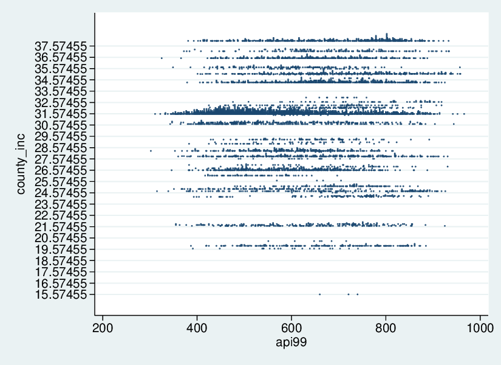
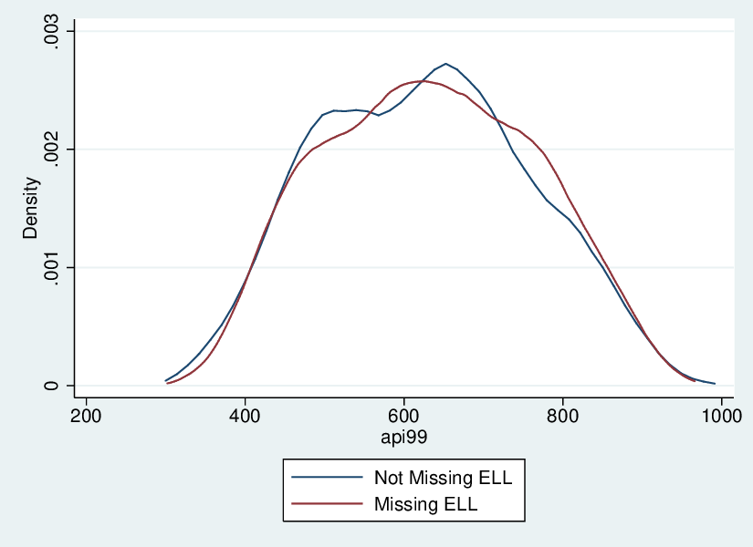
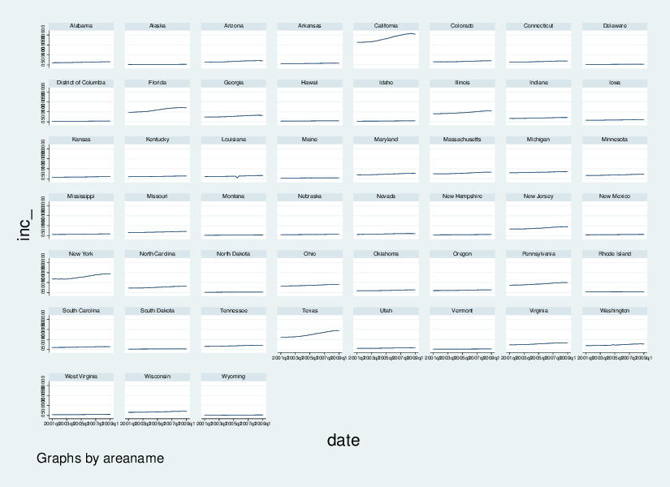

LPO 9951: More Dataset Manipulation
===================================

 

#### PURPOSE

Today we'll continue to work on dataset manipulation. We'll focus on
more complicated merges as well as reshaping.

 

Downloading `ado` files, setting globals, and loading data
----------------------------------------------------------

To start, we need to create some example datasets so that we can use
them for merging.

    . preserve

    . collapse (mean) api99, by(cnum)

    . drawnorm county_inc, means(30) sds(5)

    . sort cnum

    . save county_data, replace
    file county_data.dta saved

    . restore

    . preserve

    . collapse (mean) api99, by(dnum)

    . rename api99 api99c

    . gen edd = rbinomial(1,.3)

    . save district_data, replace
    file district_data.dta saved

    . restore

 

Many-to-one match merging
-------------------------

Many times we'd like to add information about a unit that is the same
across a grouping of units. For instance, we may want to add some county
data to our already existing school-level data. This really isn't much
different than the merging we've done before, except we need to make
certain that the variables are sorted correctly.

Let's say we have county level data that we'd like to import into our
school level dataset. Remember that we sorted the county data by the
county number (its unique id) when we created the dataset. We do the
same for the district data. Finally we merge the two together:

    . // sort to aid in merge
    . sort cnum

    . // merge many-to-one
    . merge m:1 cnum using county_data
    (note: variable api99 was int, now float to accommodate using data's values)

        Result                           # of obs.
        -----------------------------------------
        not matched                             0
        matched                             6,194  (_merge==3)
        -----------------------------------------

Inspecting the merge:

    . tab _merge

                     _merge |      Freq.     Percent        Cum.
    ------------------------+-----------------------------------
                matched (3) |      6,194      100.00      100.00
    ------------------------+-----------------------------------
                      Total |      6,194      100.00

    . list cnum api99 county_inc if _n < 10

          +-------------------------+
          | cnum   api99   county~c |
          |-------------------------|
       1. |    1     693   27.79561 |
       2. |    1     589   27.79561 |
       3. |    1     572   27.79561 |
       4. |    1     732   27.79561 |
       5. |    1     784   27.79561 |
          |-------------------------|
       6. |    1     725   27.79561 |
       7. |    1     765   27.79561 |
       8. |    1     667   27.79561 |
       9. |    1     792   27.79561 |
          +-------------------------+

    . // plot and save
    . onewayplot api99, by(county_inc) stack ms(oh) msize(*.1) width(1) name(api99_
    > ow)

    . graph export ${plotdir}api99_ow.eps, name(api99_ow) replace
    (file api99_ow.eps written in EPS format)

 

#### Quick Exercise

> Create a (fake) county level variable for average educational
> spending. It should be normally distributed and have a mean of 8000
> and a standard deviation of 1000. Add this variable to a county-level
> dataset and merge this new dataset into the api dataset.

 

One-to-many match merging
-------------------------

One to many match merging is the reverse of many to one, and isn't
really recommended. If you have to, here's how to do it:

Let's say we have some district data on whether or not the principal has
an EdD. We can open this up and merge the api data with it, matching on
district number. It's generally better to have the *finer-grained*
dataset open in memory, and then to match the *coarser* data to that
one, doing a many-to-one match merge. But should you need to complete a
one-to-many match merge, here's an example:

    . use api, clear

    . // sort to aid in merge
    . sort dnum

    . // save newly sorted dataset
    . save api, replace
    file api.dta saved

    . // load example data
    . use district_data, clear

    . // sort to aid in merge
    . sort dnum

    . // merge one-to-many
    . merge 1:m dnum using api

        Result                           # of obs.
        -----------------------------------------
        not matched                             0
        matched                             6,194  (_merge==3)
        -----------------------------------------

    . // inspect one-to-many merge
    . tab _merge

                     _merge |      Freq.     Percent        Cum.
    ------------------------+-----------------------------------
                matched (3) |      6,194      100.00      100.00
    ------------------------+-----------------------------------
                      Total |      6,194      100.00

    . list dnum api99 edd if _n < 10

          +--------------------+
          | dnum   api99   edd |
          |--------------------|
       1. |    1     491     1 |
       2. |    2     856     0 |
       3. |    3     760     1 |
       4. |    4     717     0 |
       5. |    5     669     1 |
          |--------------------|
       6. |    6     667     0 |
       7. |    7     857     1 |
       8. |   10     411     0 |
       9. |   12     782     0 |
          +--------------------+

    . // messy merge
    . use api, clear

    . preserve

    . drop api00 ell mobility

    . sample 90
    (619 observations deleted)

    . save api_99, replace
    file api_99.dta saved

    . restore

    . drop api99

    . sample 90
    (619 observations deleted)

    . save api_00, replace
    file api_00.dta saved

    . // merge datasets
    . merge snum using api_99, sort
    (note: you are using old merge syntax; see [D] merge for new syntax)
    (label stype already defined)
    (label sch_wide already defined)
    (label comp_imp already defined)
    (label both already defined)
    (label awards already defined)
    (label yr_rnd already defined)

 

#### Quick Exercise

> Create a (fake) district level variable for average teacher salary. It
> should have a mean of 40 and a standard deviation of 5. Merge the api
> data into this dataset.

 

Messy merge
-----------

Many merge procedures are quite messy. To simulate this, let's eliminate
a couple of variables from the `api` dataset and remove 10% of the
observations. We'll put this into a file we're pretending is the `api99`
file. Next, we'll drop some data from the `api00` file. Finally, we'll
merge the resulting two files together.

    . use api, clear

    . preserve

    . drop api00 ell mobility

    . sample 90
    (619 observations deleted)

    . save api_99, replace
    file api_99.dta saved

    . restore

    . drop api99

    . sample 90
    (619 observations deleted)

    . save api_00, replace
    file api_00.dta saved

    . // merge datasets
    . merge snum using api_99, sort
    (note: you are using old merge syntax; see [D] merge for new syntax)
    (label stype already defined)
    (label sch_wide already defined)
    (label comp_imp already defined)
    (label both already defined)
    (label awards already defined)
    (label yr_rnd already defined)

    . // inspect messy merge
    . tab _merge

         _merge |      Freq.     Percent        Cum.
    ------------+-----------------------------------
              1 |        562        9.16        9.16
              2 |        562        9.16       18.32
              3 |      5,013       81.68      100.00
    ------------+-----------------------------------
          Total |      6,137      100.00

These combined files are likely to have lots of missing data. Let's take
a look at some of the patterns of missing data. The first command to use
is called `inspect`. The results from the inspect command look like
this:

    . // command: inspect
    . inspect api99

    api99:                                          Number of Observations
    --------                                    ------------------------------
                                                Total   Integers   Nonintegers
    |          #                 Negative           -         -          -
    |          #                 Zero               -         -          -
    |      #   #   #             Positive        5575      5575          -
    |      #   #   #                            -----     -----      -----
    |      #   #   #             Total           5575      5575          -
    |  #   #   #   #   #         Missing          562
    +----------------------                     -----
    302                 966                      6137
    (More than 99 unique values)

    . inspect api00

    api00:                                          Number of Observations
    --------                                    ------------------------------
                                                Total   Integers   Nonintegers
    |          #                 Negative           -         -          -
    |          #   #             Zero               -         -          -
    |      #   #   #             Positive        5575      5575          -
    |      #   #   #                            -----     -----      -----
    |      #   #   #             Total           5575      5575          -
    |  #   #   #   #   #         Missing          562
    +----------------------                     -----
    346                 969                      6137
    (More than 99 unique values)

This gives you a nice quick glance at the variable in question. You can
also use the `mdesc` command, the output of which looks like this:

    . mdesc api99 api00 

        Variable    |     Missing          Total     Percent Missing
    ----------------+-----------------------------------------------
              api99 |         562          6,137           9.16
              api00 |         562          6,137           9.16
    ----------------+-----------------------------------------------

This is helpful in giving you a sense of how much missing data you have.
Last, you can also use the `mvpatterns` command, which gives you a sense
of the patterns of missing data in your dataset:

    . mvpatterns api99 api00 ell mobility
    Variable     | type     obs   mv   variable label
    -------------+----------------------------------------------
    api99        | int     5575  562   
    api00        | int     5575  562   
    ell          | byte    5575  562   english language learners
    mobility     | byte    5571  566   pct 1st year in school
    ------------------------------------------------------------

    Patterns of missing values

      +------------------------+
      | _pattern   _mv   _freq |
      |------------------------|
      |     ++++     0    5009 |
      |     .+++     1     562 |
      |     +...     3     562 |
      |     +++.     1       4 |
      +------------------------+

Why do we care so much about missing values? Because the missingness of
variable values is unlikely to be random across all observations.
Instead, observations with missing values for covariate *X* may have
different average values for covariate *Z* than those who don't have
missing values. These differences can greatly skew inferences we might
hope to make with our analyses, so it is important that we have an
understanding of the missingness of our data.

Here is a graphical example of the differences in `api99` scores between
students with `ell` data and those without:

    . gen ell_flag = ell == .

    . // plot kernel density of api99 of observations missing ell
    . kdensity api99 if ell_flag == 1, ///
    >     name(api99_kdens) ///
    >     addplot(kdensity api99 if ell_flag == 0) ///
    >     legend(label(1 "Not Missing ELL")  label(2 "Missing ELL")) ///
    >     note("") ///
    >     title("")

    . graph export api99_kdens.eps, name(api99_kdens) replace
    (file api99_kdens.eps written in EPS format)

 

#### Quick Exercise

> Create a new dataset by dropping the meals and emergency credentials
> variables. Eliminate half of the data. Next create another dataset,
> dropping the parental education variables, and again get rid of half
> of the data. Merge the remaining two datasets together, then describe
> the patterns of missing data.

 

Reshaping data
--------------

### Wide to long

The last major type of data manipulation is known as `reshaping`. Many
datasets have multiple observations per unit. One way to store this type
of data is in a wide format, meaning each additional observation is
another variable. Here's some data from the Bureau of Economic Analysis
on quarterly income growth that's in wide format:

    . // read in data and sort
    . insheet using income.csv, comma clear
    (35 vars, 60 obs)

    . sort fips

    . // reshape long

We want to have this data in long format, meaning that there will be
multiple lines per unit, each one identifying a year and a quarter. The
command for this is `reshape long <stub>, i(<index>) j(<time var>)`. As
you can see after the command, each unit/year now has its own line, and
income is a single variable.

    . reshape long inc_, i(fips) j(year_quarter, string)
    (note: j = 2001q1 2001q2 2001q3 2001q4 2002q1 2002q2 2002q3 2002q4 2003q1 2003q
    > 2 2003q3 2003q4 2004q1 2004q2 2004q3 2004q4 2005q1 2005q2 2005q3 2005q4 2006q
    > 1 2006q2 2006q3 2006q4 2007q1 2007q2 2007q3 2007q4 2008q1 2008q2 2008q3 2008q
    > 4 2009q1)

    Data                               wide   ->   long
    -----------------------------------------------------------------------------
    Number of obs.                       60   ->    1980
    Number of variables                  35   ->       4
    j variable (33 values)                    ->   year_quarter
    xij variables:
       inc_2001q1 inc_2001q2 ... inc_2009q1   ->   inc_
    -----------------------------------------------------------------------------

    . // create date that stata understands
    . gen date = quarterly(year_quarter, "YQ")

    . // format date so we understand it
    . format date %tq

    . // list few rows
    . list if _n < 10

          +----------------------------------------------------+
          | fips   year_q~r        areaname      inc_     date |
          |----------------------------------------------------|
       1. |    0     2001q1   United States   8681021   2001q1 |
       2. |    0     2001q2   United States   8713764   2001q2 |
       3. |    0     2001q3   United States   8726357   2001q3 |
       4. |    0     2001q4   United States   8746826   2001q4 |
       5. |    0     2002q1   United States   8802758   2002q1 |
          |----------------------------------------------------|
       6. |    0     2002q2   United States   8876427   2002q2 |
       7. |    0     2002q3   United States   8888413   2002q3 |
       8. |    0     2002q4   United States   8923886   2002q4 |
       9. |    0     2003q1   United States   8985759   2003q1 |
          +----------------------------------------------------+

We can now more easily set the date in a format Stata understands and
take advantage of graphing commands such as `xtline`:

    . xtset fips date, quarterly
           panel variable:  fips (strongly balanced)
            time variable:  date, 2001q1 to 2009q1
                    delta:  1 quarter

    . // drop non-states
    . drop if fips < 1 | fips > 56
    (297 observations deleted)

    . // graph
    . xtline inc_, i(areaname) t(date) name(xtline_fipsinc)

    . graph export ${plotdir}xtline_fipsinc.eps, name(xtline_fipsinc) replace
    (file xtline_fipsinc.eps written in EPS format)

 

### Long to wide

The reverse of the above is reshaping from long to wide. To shift the
above dataset back, use the same command, but substitute `wide` for
`long`:

    . // drop date that we added (no longer needed)
    . drop date

    . // long to wide
    . reshape wide inc_, i(fips) j(year_quarter, string)
    (note: j = 2001q1 2001q2 2001q3 2001q4 2002q1 2002q2 2002q3 2002q4 2003q1 2003q
    > 2 2003q3 2003q4 2004q1 2004q2 2004q3 2004q4 2005q1 2005q2 2005q3 2005q4 2006q
    > 1 2006q2 2006q3 2006q4 2007q1 2007q2 2007q3 2007q4 2008q1 2008q2 2008q3 2008q
    > 4 2009q1)

    Data                               long   ->   wide
    -----------------------------------------------------------------------------
    Number of obs.                     1683   ->      51
    Number of variables                   4   ->      35
    j variable (33 values)     year_quarter   ->   (dropped)
    xij variables:
                                       inc_   ->   inc_2001q1 inc_2001q2 ... inc_20
    > 09q1
    -----------------------------------------------------------------------------

    . // list first rows
    . list if _n < 4

         +------------------------------------------------------------------------+
      1. | fips | inc_~1q1 | inc_~1q2 | inc_~1q3 | inc_~1q4 | inc_~2q1 | inc_~2q2 |
         |    1 |   109274 |   110408 |   110688 |   111313 |   112368 |   113461 |
         |------------------------------------------------------------------------|
         | inc_~2q3  | inc_~2q4  | inc_~3q1  | inc_~3q2  | inc_~3q3  |  inc_~3q4  |
         |   114291  |   115220  |   116690  |   117483  |   118720  |    120532  |
         |-----------+-----------+-----------+-----------+-----------+------------|
         | inc_~4q1  | inc_~4q2  | inc_~4q3  | inc_~4q4  | inc_~5q1  |  inc_~5q2  |
         |   122976  |   125119  |   126811  |   130174  |   130665  |    132880  |
         |-----------+-----------+-----------+-----------+-----------+------------|
         | inc_~5q3  | inc_~5q4  | inc_~6q1  | inc_~6q2  | inc_~6q3  |  inc_~6q4  |
         |   133344  |   137933  |   138491  |   140760  |   142824  |    144444  |
         |-----------+-----------+-----------+-----------+-----------+------------|
         | inc_~7q1  | inc_~7q2  | inc_~7q3  | inc_~7q4  | inc_~8q1  |  inc_~8q2  |
         |   147643  |   149042  |   150891  |   152389  |   153897  |    158468  |
         |-----------------------------------+------------------------------------|
         |    inc_~8q3     |    inc_~8q4     |    inc_~9q1     |     areaname     |
         |      157344     |      156638     |      156690     |      Alabama     |
         +------------------------------------------------------------------------+

         +------------------------------------------------------------------------+
      2. | fips | inc_~1q1 | inc_~1q2 | inc_~1q3 | inc_~1q4 | inc_~2q1 | inc_~2q2 |
         |    2 |    19620 |    20092 |    20146 |    20341 |    20462 |    20642 |
         |------------------------------------------------------------------------|
         | inc_~2q3  | inc_~2q4  | inc_~3q1  | inc_~3q2  | inc_~3q3  |  inc_~3q4  |
         |    20779  |    21006  |    20783  |    21155  |    21251  |     21550  |
         |-----------+-----------+-----------+-----------+-----------+------------|
         | inc_~4q1  | inc_~4q2  | inc_~4q3  | inc_~4q4  | inc_~5q1  |  inc_~5q2  |
         |    21979  |    22189  |    22555  |    23015  |    23607  |     23854  |
         |-----------+-----------+-----------+-----------+-----------+------------|
         | inc_~5q3  | inc_~5q4  | inc_~6q1  | inc_~6q2  | inc_~6q3  |  inc_~6q4  |
         |    24346  |    24700  |    25294  |    25815  |    26085  |     26535  |
         |-----------+-----------+-----------+-----------+-----------+------------|
         | inc_~7q1  | inc_~7q2  | inc_~7q3  | inc_~7q4  | inc_~8q1  |  inc_~8q2  |
         |    26882  |    27180  |    27367  |    27662  |    29105  |     29712  |
         |-----------------------------------+------------------------------------|
         |    inc_~8q3     |    inc_~8q4     |    inc_~9q1     |     areaname     |
         |       30091     |       30335     |       29371     |       Alaska     |
         +------------------------------------------------------------------------+

         +------------------------------------------------------------------------+
      3. | fips | inc_~1q1 | inc_~1q2 | inc_~1q3 | inc_~1q4 | inc_~2q1 | inc_~2q2 |
         |    4 |   137195 |   138552 |   139826 |   139842 |   142595 |   143488 |
         |------------------------------------------------------------------------|
         | inc_~2q3  | inc_~2q4  | inc_~3q1  | inc_~3q2  | inc_~3q3  |  inc_~3q4  |
         |   144410  |   146108  |   147196  |   149424  |   151205  |    154504  |
         |-----------+-----------+-----------+-----------+-----------+------------|
         | inc_~4q1  | inc_~4q2  | inc_~4q3  | inc_~4q4  | inc_~5q1  |  inc_~5q2  |
         |   159779  |   163073  |   165946  |   170893  |   175472  |    180311  |
         |-----------+-----------+-----------+-----------+-----------+------------|
         | inc_~5q3  | inc_~5q4  | inc_~6q1  | inc_~6q2  | inc_~6q3  |  inc_~6q4  |
         |   185625  |   188724  |   194543  |   197373  |   201417  |    204527  |
         |-----------+-----------+-----------+-----------+-----------+------------|
         | inc_~7q1  | inc_~7q2  | inc_~7q3  | inc_~7q4  | inc_~8q1  |  inc_~8q2  |
         |   205774  |   207079  |   210275  |   211284  |   212797  |    215657  |
         |-----------------------------------+------------------------------------|
         |    inc_~8q3     |    inc_~8q4     |    inc_~9q1     |     areaname     |
         |      214590     |      212970     |      211477     |      Arizona     |
         +------------------------------------------------------------------------+

 

#### Quick Exercise

> Download data on personal per capita from 1950 to the present for all
> 50 states from the [Bureau of Economic
> Analysis](http://www.bea.gov/regional/downloadzip.cfm). Create a plot
> using the `xtline` command.

   

*Init: 16 August 2015; Updated: 25 September 2017*

 
