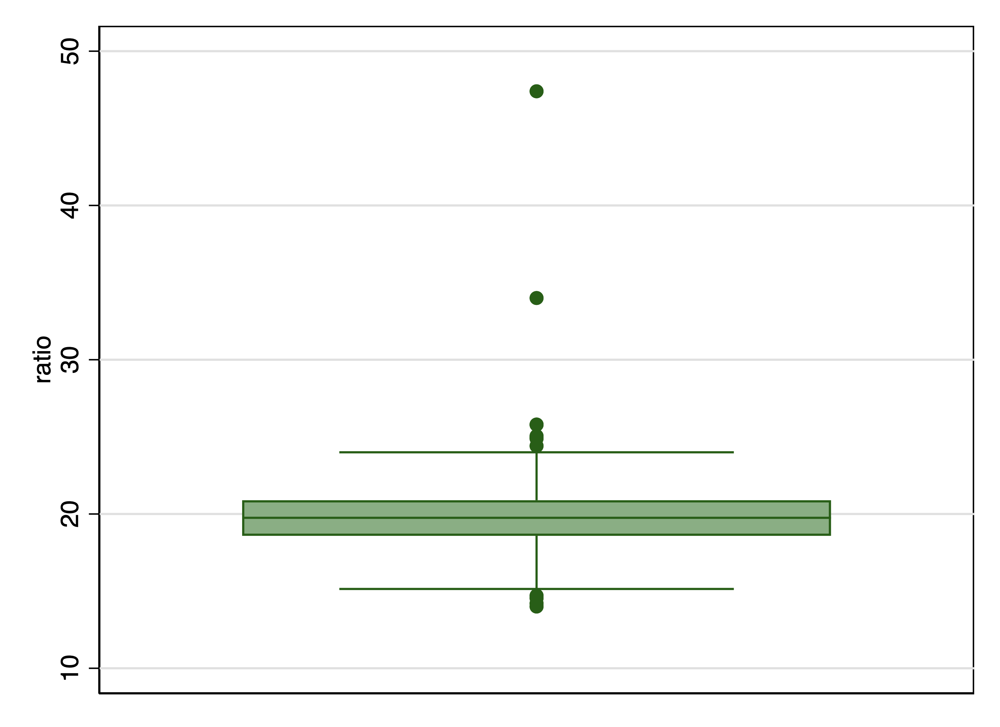
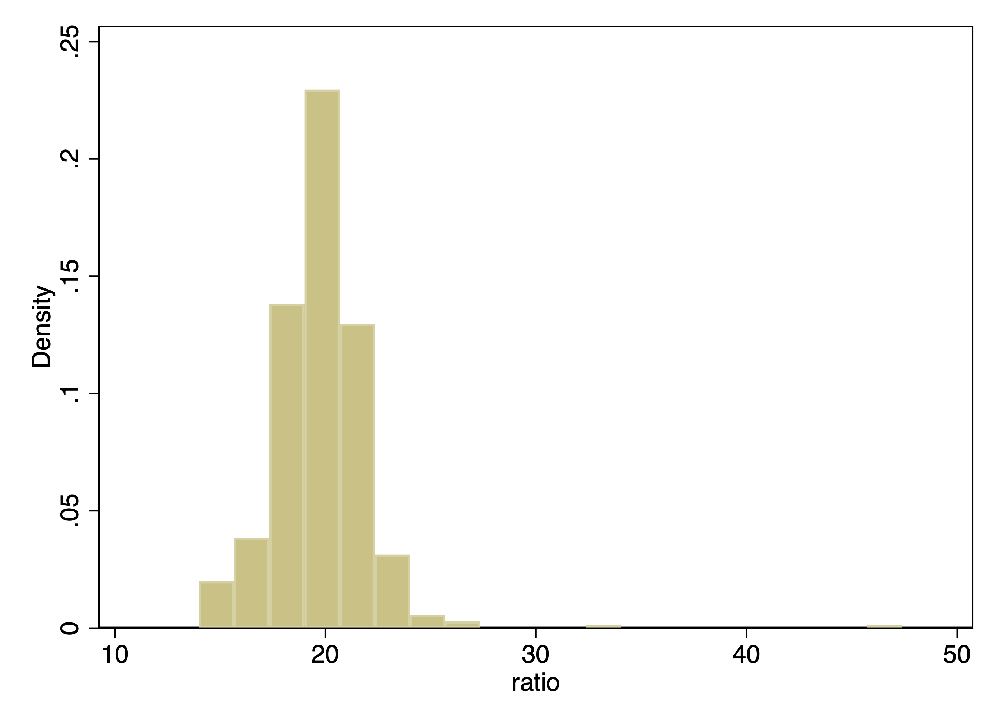
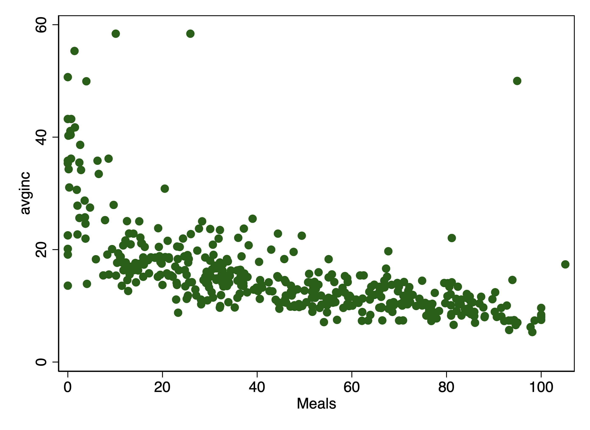
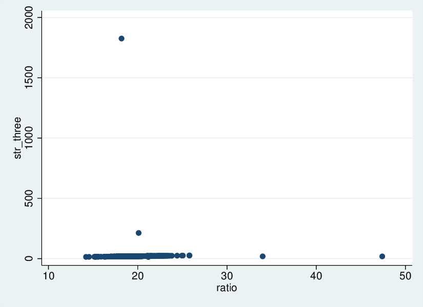
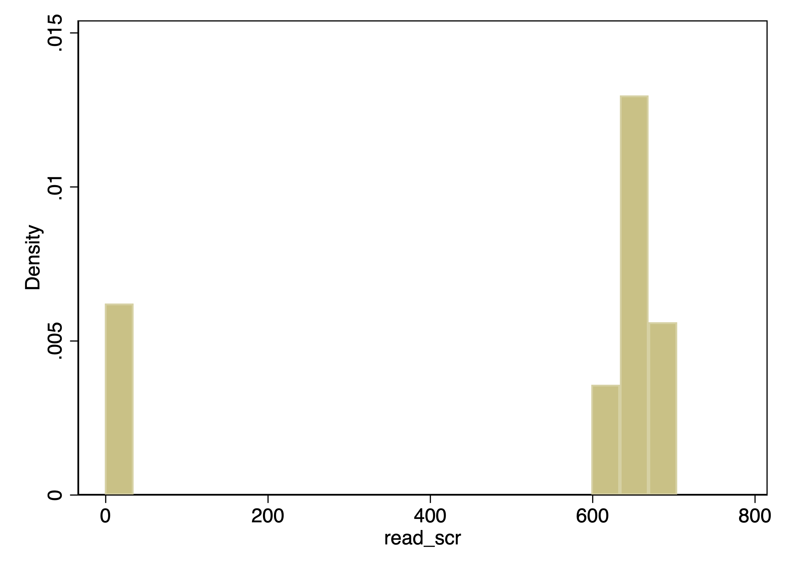

Data cleaning
================
LPO 9951 | Fall 2018

 

#### PURPOSE

Data cleaning is a term which refers to a variety of highly applied activities that are intended to ensure that the data are not, in some way, incorrect.

A "clean" dataset is one in which every variable is labeled appropriately, and organized in a way that will make sense to a user. If missing data exists, there is a unified approach to dealing with it (i.e., every missing data point is coded in the same way). The data have been checked for consistency using a variety of more or less common sense approaches. It's important to note from the outset that data-cleaning is not a specific data analytic approach so much as an attitude about the data, combined with some specific techniques. Here are some, but only some, of those techniques.

We'll be using a deliberately "dirtied up" dataset. This is based on the `caschools` data, which contains data on all of the school districts in the state of California.

 

Variable labels
---------------

Not everyone you work with will be as well-trained as you. Large datasets that are appended over time (think institutional data) also have a tendency to suffer from drift or entropy. Many times you will receive a dataset with incomplete or incomprehensible variable labels. You will need to figure out what to do with these. The labels in this example dataset are obviously a mess.

    . use caschool_problem, replace

    . // replacing problematic variable labels 
    . describe

    Contains data from caschool_problem.dta
      obs:           420                          
     vars:            19                          19 Oct 2010 10:56
     size:        60,060                          
    ------------------------------------------------------------------------------------------
                  storage   display    value
    variable name   type    format     label      variable label
    ------------------------------------------------------------------------------------------
    observation_n~r float   %9.0g                 Observation
    dist_cod        float   %9.0g                 District Code
    county          str18   %18s                  County
    district        str53   %53s                  District
    gr_span         str8    %8s                   gr
    enrl_tot        float   %9.0g                 Enrollment as of census
    teachers        float   %9.0g                 teachers
    calw_pct        float   %9.0g                 
    meal_pct        float   %9.0g                 Meals
    computer        float   %9.0g                 computer
    testscr         float   %9.0g                 API INDEX
    comp_stu        float   %9.0g                 comp_stu
    expn_stu        float   %9.0g                 Expenditures per student
    str             float   %9.0g                 ratio
    avginc          float   %9.0g                 avginc
    el_pct          float   %9.0g                 ELL
    read_scr        float   %9.0g                 
    math_scr        float   %9.0g                 
    foo             float   %9.0g                 
    ------------------------------------------------------------------------------------------
    Sorted by:  

    . label variable gr_span "Grade Span"

 

#### Quick Exercise

> Rename the variable labels to be appropriate and descriptive.

 

Techniques for working with single variables
--------------------------------------------

Each of the following describes techniques that can help you to find data points that may be unreliable or wrong. When you find such a data point, you need to rely on your judgment and the context of the problem to decide what to do next.

### Outliers

Look for outliers: values that are extraordinarily far from the mean or median (e.g., more than 3 s.d. away for approximately normal data).

Let's take a look at student teacher ratio using the `boxplot` and `histogram` commands.

    . graph box str, name(box_str)

    . graph export  box_str.eps, name(box_str) replace
    (note: file box_str.eps not found)
    (file box_str.eps written in EPS format)

    . // histogram str

#### Box plot of `str`

    . histogram str, name(hist_str)
    (bin=20, start=14, width=1.6700001)

    . graph export  hist_str.eps, name(hist_str) replace
    (note: file hist_str.eps not found)
    (file hist_str.eps written in EPS format)

#### Histogram of `str`

 

As you can see, there are two values of student teacher ratio that are big outliers. What should we do about these?

 

#### Quick Exercise

> There's another variable that has an extreme outlier. Find this variable and decide what to do about it.

 

### Atypical values

Look for values that are atypical given the context of the student. For instance, be vary of students in rural schools who report living in a town of 2 million.

 

### Impossible values

You should also look for impossible values. These include: negative values for things that must be positive like income or height; test scores that are above the maximum; proportions that are negative or above one; or percentages that are negative or above 100.

Here's a summary of the `calw_pct` variable, which is expressed in percentage terms. It clearly has at least one impossible value.

    . sum calw_pct

        Variable |       Obs        Mean    Std. Dev.       Min        Max
    -------------+--------------------------------------------------------
        calw_pct |       420    13.46038    12.25822          0      102.7

 

#### Quick Exercise

> There's another variable that has at least one impossible value. Find it.

 

### Data that are off trend

When looking at data that are in panel format, very sharp changes from the previous period may be suspect. For instance, a student who goes from the 5th percentile to the 95th percentile in test scores.

Comparing two or more variables
-------------------------------

### Checking relationships

Check to make sure that the variable is in the order that you would expect in the comparison. Are there high income students that are coded as low SES? Are there students with low GPAs and high test scores? These may be correct, but you need to check for strange patterns.

To test this, let's plot several of the variables against one another and look for problematic relationships. Here's a plot of average income, `avginc`, against the percent of students in the district on free or reduced price lunches, `meal_pct`:

    . graph twoway scatter avginc meal_pct, name(sc_inc_meal)

    . graph export  sc_inc_meal.eps, name(sc_inc_meal) replace
    (note: file sc_inc_meal.eps not found)
    (file sc_inc_meal.eps written in EPS format)

#### Average income by percentage of students on free meals

 

#### Quick Exercise

> There's another implausible value based on the relationship between two variables. Find it. (Hint: what is the biggest budget item in any school district?)  

### Logically impossible combinations

Check that there aren't logically impossible combinations of variables. For example, we should be suspicious when a parent's age is less than that of the student. Sometimes your dataset documentation will alert you to potential problems. The codebook of the National Longitudinal Survey of Youth, 1997, helpfully explains that "researchers should note that \[work hour\] totals above 168 hours per week are suspect."

 

Check calculations
------------------

Check to make sure that calculations have been done correctly. For example this dataset has several ratio measures. Let's recalculate these and see if they are correct. In the code below we recalculate the student teacher ratio and then plot it against the original calculation.

    . // create new student teacher ratio variable
    . gen str_two = enrl_tot / teachers

    . // twoway scatter of both student teacher ratio variables
    . graph twoway scatter str_two str, name(sc_str_str_two)

    . graph export  sc_str_str_two.eps, name(sc_str_str_two) replace
    (note: file sc_str_str_two.eps not found)
    (file sc_str_str_two.eps written in EPS format)

#### Student teacher ratio, recalculated and plotted against old

 

That's not good. Not good at all. `teacher` has a lot of the same -4 values. Maybe that means something. Clearly a school can't have -4 teachers. Let's recompute the ratio but only for schools with a positive number of teachers.

    . replace teachers = . if teachers == -4
    (67 real changes made, 67 to missing)

    . // create another new student teacher ratio variable
    . gen str_three = enrl_tot / teachers
    (67 missing values generated)

    . // twoway scatter of new new and old student teacher ratio variables
    . graph twoway scatter str_three str, name(sc_str_str_three)

    . graph export  sc_str_str_three.eps, name(sc_str_str_three) replace
    (note: file sc_str_str_three.eps not found)
    (file sc_str_str_three.eps written in EPS format)

#### Student teacher ratio, re-recalculated and plotted against old

 

That's a little better, but we still clearly have some problems that we would need to deal with before a full analysis.

 

#### Quick Exercise

> There are other variables with problems in their calculations. Find them.

 

Duplicates
----------

You'll also need to look for duplicates in variables that shouldn't have any. The most obvious place to look is in *id* numbers or the equivalent. You should also check any other variable that ought to be unique. Luckily, Stata has a whole suite of duplicate commands to work with, including, the appropriately named `duplicates`.

Below is an example of a variable with no duplicates, followed by a variable with a couple of duplicates.

    . // check for duplicate observations
    . duplicates report observation_number

    Duplicates in terms of observation_number

    --------------------------------------
       copies | observations       surplus
    ----------+---------------------------
            1 |          420             0
    --------------------------------------

    . // check for duplicate district cod
    . duplicates report dist_cod

    Duplicates in terms of dist_cod

    --------------------------------------
       copies | observations       surplus
    ----------+---------------------------
            1 |          418             0
            2 |            2             1
    --------------------------------------

 

Missing data
------------

### Find missing data codes

First, figure out how missing data is coded from the codebook. Code those values as missing. That's a dot, `.`, in Stata.

 

### Recode problematic data points as missing

Next, look for impossible values as above. These should also be recoded to missing.

 

### Dealing with zeros

Now, look for zeros. Are these really zeros? What was the criteria for having a zero? Check if these should really be missing.

Your best friend here is the Stata command `inspect`. Here's the result of the `inspect` command for two of the variables:

    . // inspect test scores
    . inspect testscr

    testscr:  API INDEX                             Number of Observations
    -------------------                         ------------------------------
                                                Total   Integers   Nonintegers
    |          #                 Negative           -         -          -
    |          #                 Zero               -         -          -
    |      #   #                 Positive         420        17        403
    |      #   #   #                            -----     -----      -----
    |      #   #   #             Total            420        17        403
    |  #   #   #   #   .         Missing            -
    +----------------------                     -----
    605.55           706.75                       420
    (More than 99 unique values)

    . // inspect reading scores
    . inspect read_scr

    read_scr:                                       Number of Observations
    -----------                                 ------------------------------
                                                Total   Integers   Nonintegers
    |                  #         Negative          77        77          -
    |                  #         Zero              15        15          -
    |                  #         Positive         328        33        295
    |                  #                        -----     -----      -----
    |                  #         Total            420       125        295
    |  #   .   .   .   #         Missing            -
    +----------------------                     -----
    -1                  704                       420
    (More than 99 unique values)

 

The variable `read_scr` has a number of negative values. This warrants futher inspection.

    . histogram read_scr, name(hist_read_scr)
    (bin=20, start=-1, width=35.25)

    . graph export hist_read_scr.eps, name(hist_read_scr) replace                             
    >                  
    (note: file hist_read_scr.eps not found)
    (file hist_read_scr.eps written in EPS format)

#### Histogram of reading scores

 

#### Quick Exercise

> Look for other variables with either negative or missing values and figure out what do with them. Once you've got the data properly coded and missing entered as missing, use the `mvpatterns` command to figure out if there are systematic problems with your data.

 

Conclusion
----------

All of the above is only to get you started. There is no cookbook way to approach data cleaning. The idea is to get to know the data well enough that you know whether anomalies are just strange, but true, or problems in the data themselves.

  

*Init: 25 August 2015; Updated: 24 October 2016*

 
