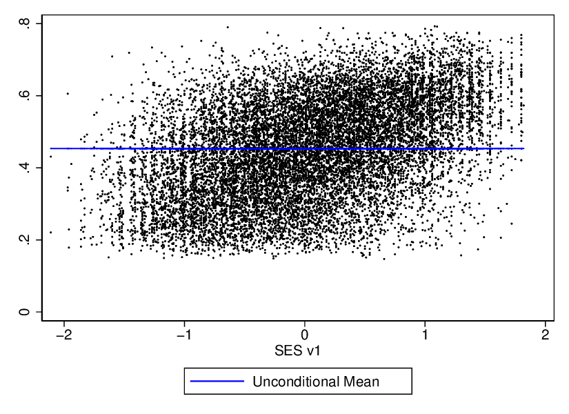
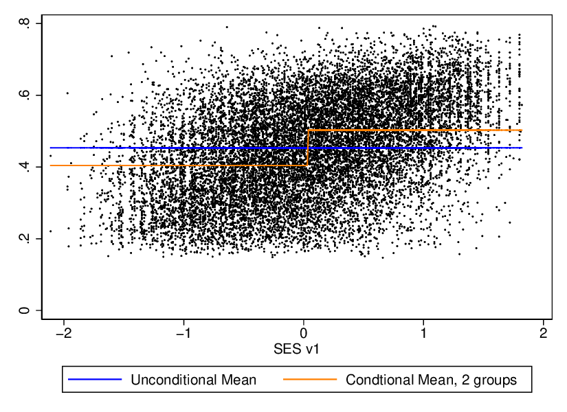
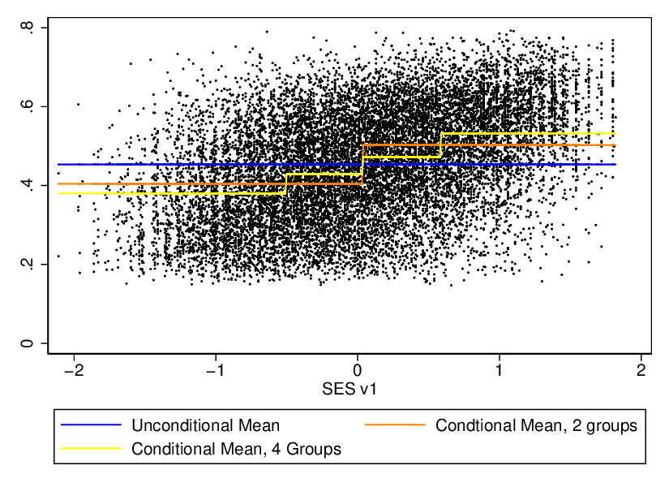
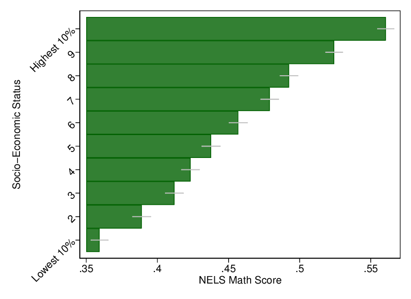
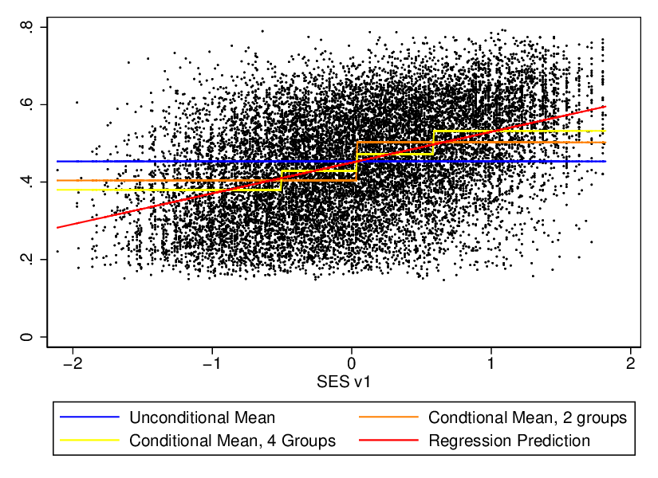

Regression and Conditional Means
================
LPO 9952 | Spring 2018

Unconditional Means as a Prediction
-----------------------------------

In most of our day-to-day thinking, we use unconditional means as the basis for making predictions. For instance, if I asked you to predict the temperature on June 1st of this year, you’d most likely simply say it would be the average temperature for that day or that time of year.

In the example below, I calculate the mean of math test scores in the plans dataset and use it as a prediction. I calculate the error term, then calculate the mean squared error (which is exactly what it sounds like) as a measure of how good this prediction is. As the graphic shows, the mean is a pretty terrible predictor for most people.

    . sort byses1

    . graph twoway scatter bynels2m byses1, msize(vtiny)

    . /* Predict using the mean */
    . egen uncond_mean=mean(bynels2m)

    . /*Generate residuals */
    . gen uncond_mean_error=bynels2m-uncond_mean
    (276 missing values generated)

    . /* Square residuals */
    . gen uncond_mean_error_sq=uncond_mean_error*uncond_mean_error
    (276 missing values generated)

    . /* Get Root mean squared error */
    . quietly sum uncond_mean_error_sq

    . scalar uncond_mean_mse=r(mean)

    . scalar uncond_mean_rmse=sqrt(uncond_mean_mse)

    . graph twoway (scatter bynels2m byses1,msize(vtiny) mcolor(black)) ///
    >     (line uncond_mean byses1,lcolor(blue)), legend(order(2 "Unconditional Mean"))

    . graph export "uncond_mean.`gtype'", replace
    (file uncond_mean.eps written in EPS format)

    . // OR . . . 
    . reg bynels2m 

          Source |       SS           df       MS      Number of obs   =    15,884
    -------------+----------------------------------   F(0, 15883)     =      0.00
           Model |           0         0           .   Prob > F        =         .
        Residual |  291.041025    15,883  .018324059   R-squared       =    0.0000
    -------------+----------------------------------   Adj R-squared   =    0.0000
           Total |  291.041025    15,883  .018324059   Root MSE        =    .13537

    ------------------------------------------------------------------------------
        bynels2m |      Coef.   Std. Err.      t    P>|t|     [95% Conf. Interval]
    -------------+----------------------------------------------------------------
           _cons |   .4535452   .0010741   422.27   0.000     .4514399    .4556505
    ------------------------------------------------------------------------------

    . scalar li uncond_mean_rmse
    uncond_mean_rmse =  .13536213

*Quick Exercise* Calculate the mean of reading scores, then make a prediction and calculate the mean squared error. Plot the result.

Predictions Using Conditional Means: 2 Groups
---------------------------------------------

With condtional means, we start using more information to think about how we will make our prediction. One of the simplest ways to do this in a bivariate sense is to calculate the mean of the dependent variable for individuals who are above average and below average.

Here’s a plot of the condtional mean of math scores by SES, for above average and below average SES.

    . // Generate prediction
    . egen sesq2=cut(byses1), group(2)
    (924 missing values generated)

    . egen cond_mean2=mean(bynels2m), by(sesq2)

    . // Get residual
    . gen cond_mean2_error=bynels2m-cond_mean2
    (276 missing values generated)

    . // Square residual
    . gen cond_mean2_error_sq=cond_mean2_error*cond_mean2_error
    (276 missing values generated)

    . // Mean squared error
    . quietly sum cond_mean2_error_sq

    . scalar cond_mean2_mse=r(mean)

    . scalar cond_mean2_rmse=sqrt(cond_mean2_mse)

    . graph twoway (scatter bynels2m byses1,msize(vtiny) mcolor(black)) ///
    >              (line uncond_mean byses1,lcolor(blue)) ///
    >              (line cond_mean2 byses1,lcolor(orange)), ///
    >               legend(order(2 "Unconditional Mean" 3 "Condtional Mean, 2 groups") )

    . graph export "cond_mean2.`gtype'", replace
    (file cond_mean2.eps written in EPS format)

    . // Or . . .
    . reg sesq2

          Source |       SS           df       MS      Number of obs   =    15,236
    -------------+----------------------------------   F(0, 15235)     =      0.00
           Model |           0         0           .   Prob > F        =         .
        Residual |  3808.88422    15,235   .25000881   R-squared       =    0.0000
    -------------+----------------------------------   Adj R-squared   =    0.0000
           Total |  3808.88422    15,235   .25000881   Root MSE        =    .50001

    ------------------------------------------------------------------------------
           sesq2 |      Coef.   Std. Err.      t    P>|t|     [95% Conf. Interval]
    -------------+----------------------------------------------------------------
           _cons |   .5027566   .0040508   124.11   0.000     .4948166    .5106967
    ------------------------------------------------------------------------------

*Quick Exercise* Calculate the mean of reading scores by 2 levels of ses, then make predictions and calculate the mean squared error. Plot the result.

Predictions Using Conditional Means: 4 Groups
---------------------------------------------

We can continue with this logic through any number of arbitrary subdivsitons. Here’s a plot of the conditional mean of math scores by SES by quartile.

    . egen sesq4=cut(byses1), group(4)
    (924 missing values generated)

    . egen cond_mean4=mean(bynels2m), by(sesq4)

    . gen cond_mean4_error=bynels2m-cond_mean4
    (276 missing values generated)

    . gen cond_mean4_error_sq=cond_mean4_error*cond_mean2_error
    (276 missing values generated)

    . quietly sum cond_mean4_error_sq

    . scalar cond_mean4_mse=r(mean)

    . scalar cond_mean4_rmse=sqrt(cond_mean4_mse)

    . scalar li
           myt =  1.9614331
             n =       1616
         alpha =        .05
      reg_rmse =  .12275883
       reg_mse =  .01506973
    cond_mean10_rmse =  .17966919
    cond_mean10_mse =  .03228102
    cond_mean4_rmse =  .12365016
    cond_mean4_mse =  .01528936
    cond_mean2_rmse =  .12651073
    cond_mean2_mse =  .01600496
    uncond_mean_rmse =  .13536213
    undcond_mean_rmse =  .13536213
    uncond_mean_mse =  .01832291

    . graph twoway (scatter bynels2m byses1,msize(vtiny) mcolor(black)) ///
    >              (line uncond_mean byses1,lcolor(blue)) ///
    >              (line cond_mean2 byses1,lcolor(orange)) ///
    >              (line cond_mean4 byses1,lcolor(yellow)), ///    
    >              legend(order(2 "Unconditional Mean" 3 "Condtional Mean, 2 groups" 4 "Conditional Mean, 4 Groups")
    >  )

    . graph export "cond_mean4.`gtype'", replace
    (file cond_mean4.eps written in EPS format)

*Quick Exercise* Calculate the mean of reading scores by 4 levels of ses, then make predictions and calculate the mean squared error. Plot the result.

Predictions Using Conditional Means: 10 Groups
----------------------------------------------

This logic can be extended indefinitely. For instance, here's a plot of the conditional mean of math scores at 10 different levels of SES.

    . egen sesq10=cut(byses1), group(10)
    (924 missing values generated)

    . egen cond_mean_10_math=mean(bynels2m), by(sesq10)

    . gen cond_mean10_error=bynels2r-cond_mean_10
    (276 missing values generated)

    . gen cond_mean10_error_sq=cond_mean10_error*cond_mean10_error
    (276 missing values generated)

    . quietly sum cond_mean10_error_sq

    . scalar cond_mean10_mse=r(mean)

    . scalar cond_mean10_rmse=sqrt(cond_mean10_mse)

    . // scalar li
    . graph twoway (scatter bynels2m byses1,msize(vtiny) mcolor(black)) ///
    >              (line uncond_mean byses1,lcolor(blue)) ///
    >              (line cond_mean2 byses1,lcolor(orange)) ///
    >              (line cond_mean4 byses1,lcolor(yellow)) ///  
    >                          (line cond_mean_10_math byses1,lcolor(purple)), ///  
    >              legend(order(2 "Unconditional Mean" 3 "Condtional Mean, 2 groups" 4 "Conditional Mean, 4 Groups" 
    > 5 "Conditional Mean, 10 Groups"))

    . graph export "cond_mean10.`gtype'", replace
    (file cond_mean10.eps written in EPS format)

*Quick Exercise* Calculate the mean of reading scores by 20 levels of ses, then make predictions and calculate the mean squared error. Plot the result.

Regression is the conditional mean for ALL X's
----------------------------------------------

Regression is based on the idea of the expected value of y given, E(Y |X). If X can take on only two values, then regression will give two predictions. If X can take on 4, then it will give that many, based on the existing data. What regression does is calculate an expected value of Y at every level of X. The constraint is that the fit must be linear: it can only summarize the data using a straight line, set by two parameters (intercept and slope). How it does this is the subject of your regression class this semester. There are many ways to calculate the expected value of y given x, what makes OLS so useful is its parsimony-- in the bivariate case it requires only two parameters (slope and intercept) to be estimated. This is contrast to other, more flexible approaches, which trade off parsimony for more accurate fit.

In many cases, I will tailor my presentations for policy audiences around conditional means in exactly the way we have just done. For example, a bar plot of math scores by ses is likely more intuitive for many policy audiences than regression results, but communicates the same basic idea:

    . scalar n=_N/10

    . preserve

    . // 
    . collapse (mean) math_cond_mean=bynels2m (semean) math_cond_mean_se=bynels2m, by(sesq10)

    . scalar alpha=.05

    . scalar myt=invttail(n, alpha/2)

    . gen low_ci=math_cond_mean-(math_cond_mean_se*myt)

    . gen high_ci=math_cond_mean+(math_cond_mean_se*myt)

    . replace sesq10=sesq10+1
    (10 real changes made)

    . graph twoway (bar math_cond_mean sesq10, horizontal  ) ||  ///
    >              (rcap low_ci high_ci sesq10, horizontal msize(0) lcolor(gs12)) ///
    >                          , xtitle("NELS Math Score") ytitle("Socio-Economic Status") ///
    >                          legend(off) ///
    >                          ylabel(2(1)9 1 "Lowest 10%" 10 "Highest 10%",angle(45))

    .                          
    . graph export "horiz10.`gtype'", replace
    (note: file horiz10.eps not found)
    (file horiz10.eps written in EPS format)

    .                          
    . restore

Below, I regress math scores on SES, then predict math scores at every observed level of SES. I then plot this prediction.

    . reg bynels2m byses1

          Source |       SS           df       MS      Number of obs   =    15,236
    -------------+----------------------------------   F(1, 15234)     =   3532.18
           Model |  53.2360435         1  53.2360435   Prob > F        =    0.0000
        Residual |    229.6024    15,234  .015071708   R-squared       =    0.1882
    -------------+----------------------------------   Adj R-squared   =    0.1882
           Total |  282.838444    15,235  .018565044   Root MSE        =    .12277

    ------------------------------------------------------------------------------
        bynels2m |      Coef.   Std. Err.      t    P>|t|     [95% Conf. Interval]
    -------------+----------------------------------------------------------------
          byses1 |   .0795636   .0013387    59.43   0.000     .0769396    .0821877
           _cons |   .4504293   .0009962   452.15   0.000     .4484766    .4523819
    ------------------------------------------------------------------------------

    . predict reg_predict
    (option xb assumed; fitted values)
    (924 missing values generated)

    . predict reg_error, residual
    (924 missing values generated)

    . gen reg_error_sq=reg_error*reg_error
    (924 missing values generated)

    . quietly sum reg_error_sq

    . scalar reg_mse=r(mean)

    . scalar reg_rmse=sqrt(reg_mse)

    . graph twoway (scatter bynels2m byses1,msize(vtiny) mcolor(black)) ///
    >              (line uncond_mean byses1,lcolor(blue)) ///
    >              (line cond_mean2 byses1,lcolor(orange)) ///
    >              (line cond_mean4 byses1,lcolor(yellow)) ///
    >              (line reg_predict byses1,lcolor(red)), ///        
    >              legend(order(2 "Unconditional Mean" 3 "Condtional Mean, 2 groups" 4 "Conditional Mean, 4 Groups" 
    > 5 "Regression Prediction") )

    . graph export "regress.`gtype'", replace
    (file regress.eps written in EPS format)

    . scalar li
           myt =  1.9614331
             n =       1616
         alpha =        .05
      reg_rmse =  .12275883
       reg_mse =  .01506973
    cond_mean10_rmse =  .17966919
    cond_mean10_mse =  .03228102
    cond_mean4_rmse =  .12365016
    cond_mean4_mse =  .01528936
    cond_mean2_rmse =  .12651073
    cond_mean2_mse =  .01600496
    uncond_mean_rmse =  .13536213
    undcond_mean_rmse =  .13536213
    uncond_mean_mse =  .01832291

    end of do-file

*Quick Exercise* Use regression to predict reading scores. Compare the mse from your regression to the mse from the other methods used. What do you observe?
