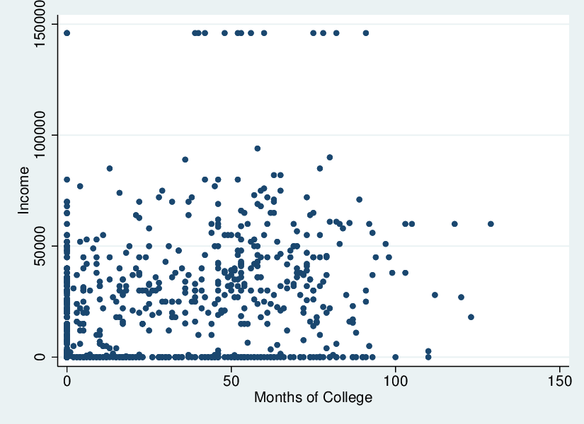
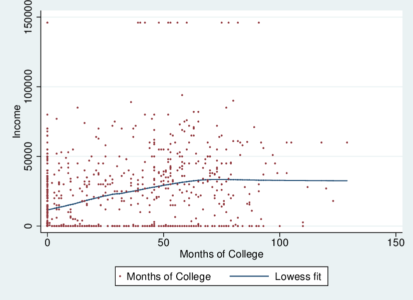
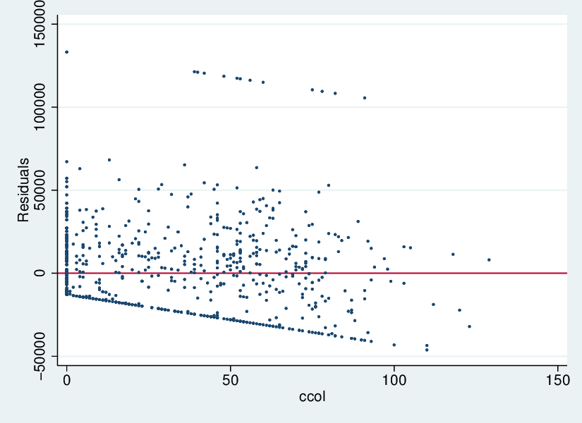
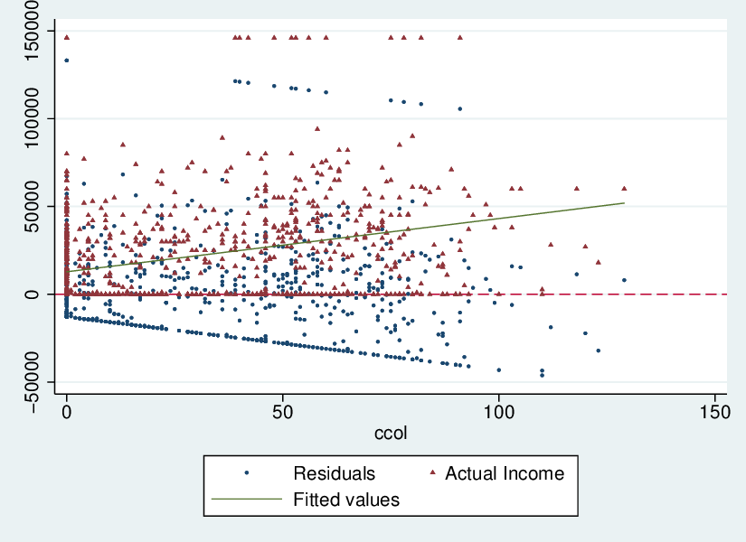

Basics of Regression in Stata
================
LPO 9952 | Spring 2020

Intro
-----

Stata was made for regression. It has the most advanced suite of regression functions and the easiest to use interface of any statistical programming environment. This session will get you started with how to estimate parameters for the simple regression model in STATA.

We'll be using data from the National Longitudinal Survey of Youth, 1997. For more information about the NLSY 97 sample, click [here](https://www.nlsinfo.org/content/cohorts/nlsy97/intro-to-the-sample/nlsy97-sample-introduction-0).

Simple regression model
-----------------------

We'll be working with the same regression model as Wooldridge, with *y* as a linear function of *x*.

*y**i* = *β**o* + *β*1*x**i* + *u**i*

We're interested in coming up with estimates of the unknown population parameters *β*0 and *β*1.

Since we'll be doing OLS, we'll make all of the standard assumptions:

-   The function *y**i* = *β**o* + *β*1*x**i* + *u* is linear in parameters

-   Our sample, including data *y**i* and *x**i* has been drawn randomly.

-   There's variation in *x*

-   The expected value of the error given the covariate is 0: *E*(*u*|*x*)=0, and the same is true in the sample, *E*(*u**i*|*x**i*)=0, meaning that *x* is fixed in repeated samples

The estimators $\\hat{\\beta\_0}$, $\\hat{\\beta\_1}$ are unbiased given the above assumptions hold. This means that $E(\\hat{\\beta\_1}=\\beta\_1)$ in repeated sampling.

Let's figure out how income and postsecondary attainment are related. Using the NLSY97 data set, we will get estimates for the following population regression model:

*i**n**c**o**m**e**i* = *β*0 + *β*1(*M**o**n**t**h**s**i*)+*u**i*

Plotting Data
-------------

Before we do this, let's do a scatterplot. The scatterplot is the most fundamental graphical tool for regression. As a starting rule, never run a regression before looking at a scatterplot. In the accompanying do file, I've included the macros for setting this up in terms of *x* and *y*.

First, let's just plot *y* as a function of *x*:

    . graph twoway scatter `y' `x', msize(small) ytitle(`ytitle') xtitle(`xtitle')

    . graph export "simple_scatter.`gtype'", replace
    (file simple_scatter.eps written in EPS format)

We can than add a lowess fit to see what the shape of the relationship between *x* and *y* looks like.

There are a variety of ways to check on the pattern on the data. A lowess regression gives you a local average estimate, which is sensitive to the patterns in the data:

    . graph twoway lowess `y' `x', msize(small) ytitle(`ytitle') xtitle(`xtitle')

    . graph export "simple_lowess.`gtype'", replace
    (file simple_lowess.eps written in EPS format)

    . graph twoway lowess `y' `x' || ///
    >       scatter `y' `x', ///
    >       msize(tiny) ///
    >       msymbol(smcircle) ///
    >       ytitle(`ytitle') ///
    >       xtitle(`xtitle') ///
    >       legend( order(2 "`xtitle'" 1 "Lowess fit") )

    .       
    . graph export "scatter_lowess.`gtype'", replace
    (file scatter_lowess.eps written in EPS format)

    . /*Exercise: do the same with another covariate*/

*Quick Exercise: do the same with another covariate*

Our next step is to plot a linear fit to the data.

    .     
    . graph twoway lfit `y' `x' || ///
    >       scatter `y' `x', ///
    >       msize(tiny) ///
    >       msymbol(cricle) ///
    >       ytitle(`ytitle') ///
    >       xtitle(`xtitle') ///
    >       legend( order(2 `xtitle' 1 "Linear fit") ) //
    (note:  named style cricle not found in class symbol, default attributes used)
    Months not an integer, option order() ignored

    .       
    . graph export "scatter_linear.`gtype'",replace
    (file scatter_linear.eps written in EPS format)

Estimating Regression in Stata
------------------------------

We start with a basic regression of income on months of postsecondary education. There are a couple of ways of describing this, one is just to say we estimate a regression predicting income as a function of postseconcary attendance. Another way is to say we regress income on postsecondary attendance.

    . reg `y' `x'

          Source |       SS           df       MS      Number of obs   =       898
    -------------+----------------------------------   F(1, 896)       =    117.29
           Model |  7.5359e+10         1  7.5359e+10   Prob > F        =    0.0000
        Residual |  5.7570e+11       896   642521746   R-squared       =    0.1157
    -------------+----------------------------------   Adj R-squared   =    0.1148
           Total |  6.5106e+11       897   725817279   Root MSE        =     25348

    ------------------------------------------------------------------------------
            yinc |      Coef.   Std. Err.      t    P>|t|     [95% Conf. Interval]
    -------------+----------------------------------------------------------------
            ccol |   303.2167   27.99823    10.83   0.000      248.267    358.1665
           _cons |   12815.63   1145.818    11.18   0.000     10566.83    15064.43
    ------------------------------------------------------------------------------

I'll go through each part of the above table in class.

*Quick Exercise*

Run a regression with same dependent variable but a different independent variable. Interpret the results in one sentence. Write this sentence down.

Extracting Results
------------------

One key skill for today is being able to extract individual parts of the regression estimates from what Stata stores in memory. You need to build a map from the equations we'll be discussing to what can be accessed in Stata. Below, we start by extracting the regression coefficients.

    . /*What's Beta? */
    . mat betamat=e(b)

The standard errors are stored as a variance-covariance matrix. To get a standard error, we need to take the square root of the elements of the diagonal of this matrix.

    . mat vcmat=e(V)

    .   
    . scalar myb=betamat[1,1]

    . scalar varbeta1=vcmat[1,1]

    . scalar sebeta1=sqrt(varbeta1)

We can use a different approach to get the same scalars. In Stata, referencing `_b[<varname>]` will pull the scalar for the coefficient asscoiated with the variable name. Similarly, referencing `_se[<varname>]` will get the standard error for that coefficient.

    . scalar beta0=_b[_cons]

    . scalar li beta0
         beta0 =  12815.633

    . scalar li 
    root_my_rss =   25319.77
        my_rss =  5.757e+11
       residss =  5.757e+11
           myk =          2
           myN =        898
      se_beta1 =  27.998234
         beta1 =  303.21674
      se_beta0 =  1145.8177
         beta0 =  12815.633
       sebeta1 =  27.998234
      varbeta1 =  783.90109
           myb =  303.21674

    . scalar se_beta0=_se[_cons]

    . scalar beta1=_b[`x']

    . scalar se_beta1=_se[`x']

    . scalar li beta1
         beta1 =  303.21674

*Quick exercise: using both of the above methods, extract the estimate for the intercept*

Confidence Intervals
--------------------

By default, Stata gives 95% confidence intervals. To get confidence intervals at a different level, use the following code:

    . reg `y' `x', level(90)

          Source |       SS           df       MS      Number of obs   =       898
    -------------+----------------------------------   F(1, 896)       =    117.29
           Model |  7.5359e+10         1  7.5359e+10   Prob > F        =    0.0000
        Residual |  5.7570e+11       896   642521746   R-squared       =    0.1157
    -------------+----------------------------------   Adj R-squared   =    0.1148
           Total |  6.5106e+11       897   725817279   Root MSE        =     25348

    ------------------------------------------------------------------------------
            yinc |      Coef.   Std. Err.      t    P>|t|     [90% Conf. Interval]
    -------------+----------------------------------------------------------------
            ccol |   303.2167   27.99823    10.83   0.000     257.1161    349.3174
           _cons |   12815.63   1145.818    11.18   0.000     10928.98    14702.29
    ------------------------------------------------------------------------------

*Quick exercise: run the regression again, but this time get 80% CI*

Residuals and Predictions
-------------------------

Residuals are not stored as part of the estimation results, but can be generated through the `predict` command. Below, I use the `predict` command to get residuals for this estimation.

    . predict uhat, residuals

    . /*Residuals sum to 0 by definition */
    . tabstat uhat, stat(sum)

        variable |       sum
    -------------+----------
            uhat | -.0592957
    ------------------------

These residuals can then be plotted as a function of *x*.

    . graph twoway scatter uhat `x',yline(0) msize(tiny)

    . graph export "residplot.`gtype'",replace
    (file residplot.eps written in EPS format)

    . /*More complex graph*/
    . graph twoway scatter uhat `x', ///
    >       msize(tiny) ///
    >       msymbol(circle) ///
    >           || ///
    >      scatter `y' `x', ///
    >      msize(tiny) ///
    >      msymbol(triangle) 

    . /*Putting the pieces together*/
    . graph twoway scatter uhat `x', ///
    >       msize(tiny) ///
    >       msymbol(circle) ///
    >           || ///
    >        scatter `y' `x', ///
    >        msize(tiny) ///
    >        msymbol(triangle) ///
    >            || ///
    >       lfit `y' `x', ///
    >       lwidth(thin) ///
    >       yline(0, lpattern(dash) lwidth(thin)) ///
    >       legend(order(1 2 "Actual `ytitle'" 3))

    . graph export "residplot_fancy.`gtype'",replace
    (file residplot_fancy.eps written in EPS format)

A more complex plot includes actual, predicted, and residual values.

The predicted value of y is also generated via the `predict` command.

    . predict yhat 
    (option xb assumed; fitted values)

    . /*Actual vs. predicted plot*/
    . graph twoway scatter yhat `x', ///
    >       msize(tiny) ///
    >       msymbol(circle) ///
    >       || ///
    >       scatter `y' `x', ///
    >       msize(tiny) ///
    >       msymbol(triangle) 

    . graph export "predict.`gtype'",replace
    (file predict.eps written in EPS format)

    . /*Do the same for another regressor */

These predicted values can be plotted relative to the actual data.

*Quick Exercise: comple the above steps with an alternative covariate*

Measures of Model Fit
---------------------

The first measure of model fit we consider is the *F* statistic. There are several ways to think about the *F* statistic. For now, I'm going to suggest that you think of it as the ratio of two measures. The first measure is the difference between the predicted value and the mean, or how different are your predictions than what would be predicted using the unconditional mean. The second measure is the difference between the predicted value and the actual value. We'll discuss this in class, but you should have an intuitive sense as to why the former should be large relative to the latter.

    . ereturn list

    scalars:
                   e(rank) =  2
                   e(ll_0) =  -10434.56770208699
                     e(ll) =  -10379.33482507662
                   e(r2_a) =  .1147610230962075
                    e(rss) =  575699484014.6326
                    e(mss) =  75358615320.30139
                   e(rmse) =  25348.01265488175
                     e(r2) =  .1157479115877391
                      e(F) =  117.2857040901462
                   e(df_r) =  896
                   e(df_m) =  1
                      e(N) =  898

    macros:
                e(cmdline) : "regress yinc ccol, level(90)"
                  e(title) : "Linear regression"
              e(marginsok) : "XB default"
                    e(vce) : "ols"
                 e(depvar) : "yinc"
                    e(cmd) : "regress"
             e(properties) : "b V"
                e(predict) : "regres_p"
                  e(model) : "ols"
              e(estat_cmd) : "regress_estat"

    matrices:
                      e(b) :  1 x 2
                      e(V) :  2 x 2

    functions:
                 e(sample)   

    . // Sample size
    . scalar myN=e(N)

    . // Number of estimated parameters
    . scalar myk=colsof(betamat)

    . /// What's the residual sum of squares? 
    > 
    . scalar residss=e(rss)

    . gen diff=`y'-yhat

    . gen diff_sq=diff*diff

    . tabstat diff_sq,stat(sum) save

        variable |       sum
    -------------+----------
         diff_sq |  5.76e+11
    ------------------------

    . mat mymat=r(StatTotal)

    . scalar my_rss=mymat[1,1]

    . scalar li residss my_rss
       residss =  5.757e+11
        my_rss =  5.757e+11

    . ///What's the model sum of squares?
    > 
    . scalar modss=e(mss)

    . tabstat `y', stat(mean) save

        variable |      mean
    -------------+----------
            yinc |  21186.17
    ------------------------

    . mat mymat=r(StatTotal)

    . scalar ybar=mymat[1,1]

    . gen diff2=yhat-ybar

    . gen diff2_sq=diff2*diff2

    . tabstat diff2_sq, stat(sum) save

        variable |       sum
    -------------+----------
        diff2_sq |  7.54e+10
    ------------------------

    . mat mymat=r(StatTotal)

    . scalar my_mss=mymat[1,1]

    . scalar li modss my_mss
         modss =  7.536e+10
        my_mss =  7.536e+10

    . /*Calculate F */
    . scalar df_resid=myN-myk

    . scalar df_m=myk-1

    . scalar modss_std=my_mss/df_m

    . scalar residss_std=my_rss/df_resid

    . scalar myf=modss_std/residss_std

    . scalar fstat=e(F)

    . scalar li myf fstat
           myf =   117.2857
         fstat =   117.2857

The most commonly used measure of model fit is *R*2. It is simply the square of the correlation between the actual dv and the predicted dv.

    . corr yhat `y'
    (obs=898)

                 |     yhat     yinc
    -------------+------------------
            yhat |   1.0000
            yinc |   0.3402   1.0000

    . scalar rsquare= e(r2)

    . /*What is adjusted r squared? */
    . scalar adj_rsquare= 1-((1-rsquare)*((myN-1)/(myN-myk)))

    .            

Below, I conduct a test of statistical significance "by hand" to show how this is done in Stata.

    . scalar my_df=myN-myk

    . scalar myt=beta1/sebeta1

    . scalar stat_sig=(2*ttail(my_df,myt))

    . scalar my_pval=.05

    . scalar req_t=invttail(my_df,(my_pval/2))

    . scalar test=cond(myt>=req_t,"Significant","Not significant")

    . exit

    end of do-file

    . scalar li
          test = Significant
         req_t =  1.9626151
       my_pval =        .05
      stat_sig =  9.044e-26
           myt =  10.829852
         my_df =        896
    adj_rsquare =  .11476102
       rsquare =  .11574791
         fstat =   117.2857
           myf =   117.2857
    residss_std =  6.425e+08
     modss_std =  7.536e+10
          df_m =          1
      df_resid =        896
        my_mss =  7.536e+10
          ybar =   21186.17
         modss =  7.536e+10
    root_my_rss =   25319.77
        my_rss =  5.757e+11
       residss =  5.757e+11
           myk =          2
           myN =        898
      se_beta1 =  27.998234
         beta1 =  303.21674
      se_beta0 =  1145.8177
         beta0 =  12815.633
       sebeta1 =  27.998234
      varbeta1 =  783.90109
           myb =  303.21674
