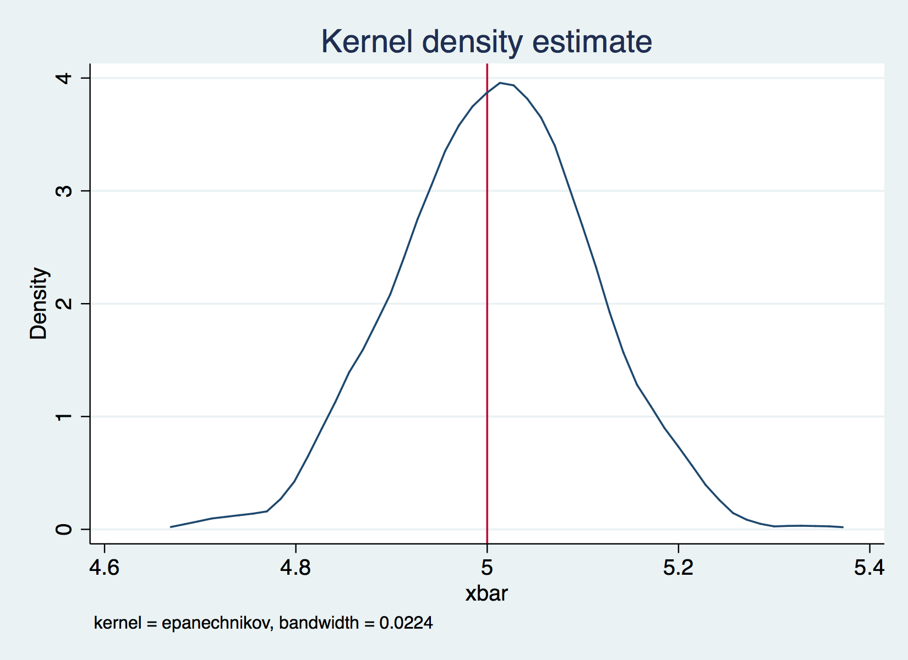

Simulation in Stata
================
LPO 9952 | Spring 2017

Simulation for Understanding
----------------------------

In most intro regression classes, the emphasis is on learning proofs, either directly or through the instructor providing intuition around proofs. However, there is another way to learn the topics: simulation. When using simulation, you create the population of interest, apply an estimator, then learn about the properties of that estimator through repeatedly sampling from the population and calculating estimates. This is known as the Monte Carlo method, in that the analyst uses repeated random sampling. The term comes from Stanislaw Ulam, who came up with the idea to solve computational problems as part of the Manhattan project. Today, we'll use simulation to understand some basic properties of regression.

Simulating the Central Limit Theoreom
-------------------------------------

We begin with a much sinmpler example. The central limit theorem says that if we repeatedly sample from a larger population, the sampling distribution of means will be normal, and will have a mean equal to the population parameter. The code below checks if that's actually the case.

    . local mymean 5

    . local mysd 1

    . local pop_size 10000

    . local sample_size 100

    . local nreps 1000

    . // Create variable x based on values above
    . drawnorm x, means(`mymean') sds(`mysd') n(`pop_size')
    (obs 10000)

    . save x, replace
    file x.dta saved

    . // Population mean
    . mean x

    Mean estimation                     Number of obs    =   10000

    --------------------------------------------------------------
                 |       Mean   Std. Err.     [95% Conf. Interval]
    -------------+------------------------------------------------
               x |   4.997567   .0098891      4.978182    5.016952
    --------------------------------------------------------------

    . scalar pop_mean=_b[x]

    . // Popoluation standard deviation
    . tabstat x, stat(sd) save

        variable |        sd
    -------------+----------
               x |  .9889123
    ------------------------

    . mat M=r(StatTotal)

    . scalar pop_sd=M[1,1]

    . preserve // Set return state

    . sample `sample_size', count // Take a sample 
    (9900 observations deleted)

    . mean x // Calculate mean 

    Mean estimation                     Number of obs    =     100

    --------------------------------------------------------------
                 |       Mean   Std. Err.     [95% Conf. Interval]
    -------------+------------------------------------------------
               x |   5.099092   .1085449      4.883715    5.314468
    --------------------------------------------------------------

    . tabstat x, stat(sd) // Calculate sds

        variable |        sd
    -------------+----------
               x |  1.085449
    ------------------------

    . restore //

    . // Is CLT a real thing?
    . if `xbar_example'==1{
    . // create a place in memory called buffer which will store a variable called xbar in
    >  a file called means.dta
    . postfile buffer xbar using means, replace 
    . forvalues i=1/`nreps'{
      2.         preserve // Set return state
      3.         quietly sample `sample_size', count // Keep only certain observations
      4.         quietly mean x // get mean
      5.         post buffer (_b[x]) // post the estimate to the buffer
      6.         restore // Go back to full dataset
      7. }
    . postclose buffer // Buffer can stop recording
    . use means, clear
    . kdensity xbar,xline (`mymean')
    . graph export clt.`gtype', replace
    (file clt.eps written in EPS format)
    . mean xbar

    Mean estimation                     Number of obs    =    1000

    --------------------------------------------------------------
                 |       Mean   Std. Err.     [95% Conf. Interval]
    -------------+------------------------------------------------
            xbar |   4.999501   .0030579        4.9935    5.005502
    --------------------------------------------------------------
    . scalar simulate_mean=_b[xbar]
    . //Here's whate SE should be:
    . scalar hypo_se=`mysd'/sqrt(`sample_size')
    . //Here's what SE is: 
    . tabstat xbar,stat(sd) save

        variable |        sd
    -------------+----------
            xbar |  .0966992
    ------------------------
    . mat M=r(StatTotal)
    . scalar simulate_se=M[1,1]
    . }

We can compare our estimate of $\\bar{x}$ with the value we specified to see if the value in repeated samples does indeed converge on the true population parameter.

*Quick Exercise* Does our estimate of the standard deviation follow the same pattern as our estimate of the mean?

Basic Regression
----------------

In regression, the central finding is the same, but as applied to coefficients. That is, in repeated samples, the sampling distribution of coefficients will be distributed normal, with a standard error equivalent to the standard deviation of the sampling distribution. Below we generate a population where `y` is a linear function of `x1` plus an error term. We then repeatedly sample from that population, calculate our estimate of the parameter of interest, and accumulate results over multiple iterations. We can then show an empirical representation of the sampling distritbuion.

    . use x, clear

    . // Generate error term
    . local error_sd 10

    . drawnorm e, means(0) sds(`error_sd')

    . // Set values for parameters
    . local beta_0=10

    . local beta_1=2

    . // Generate outcome
    . gen y=`beta_0'+`beta_1'*x+e

    . // Run MC study for basic regression
    . if `reg_example_1'==1{
    . // create a place in memory called buffer which will store a variable called xbar in
    >  a file called means.dta
    . postfile buffer beta_0 beta_1 using reg_1, replace 
    . forvalues i=1/`nreps'{
      2.         preserve // Set return state
      3.         quietly sample `sample_size', count // Keep only certain observations
      4.         quietly reg y  x // get parameter estimates
      5.         post buffer (_b[_cons]) (_b[x]) // post the estimate to the buffer
      6.         restore // Go back to full dataset
      7. }
    . postclose buffer // Buffer can stop recording
    . // Open up results of MC study for basic regression
    . use reg_1, clear
    . kdensity beta_0, xline(`beta_0')
    . graph export beta_0.`gtype', replace
    (file beta_0.eps written in EPS format)
    . kdensity beta_1, xline(`beta_1')
    . graph export beta_1.`gtype', replace
    (file beta_1.eps written in EPS format)
    . mean beta_0

    Mean estimation                     Number of obs    =    1000

    --------------------------------------------------------------
                 |       Mean   Std. Err.     [95% Conf. Interval]
    -------------+------------------------------------------------
          beta_0 |   9.692618   .1630616      9.372635     10.0126
    --------------------------------------------------------------
    . mean beta_1

    Mean estimation                     Number of obs    =    1000

    --------------------------------------------------------------
                 |       Mean   Std. Err.     [95% Conf. Interval]
    -------------+------------------------------------------------
          beta_1 |   2.048219   .0317356      1.985943    2.110495
    --------------------------------------------------------------
    . }

As with the above example, we can compare our estimates of *β*0 and *β*1 to the values we set.

*Quick Exercise* What if `y` is not normally distributed? Does regression still work then?

*Quick Exercise* What if the error term is not normally distributed? Does regression still work then?

Multiple Regression
-------------------

One key question for regression is omitted variables bias. The idea here is that there is an additional variable `x2` that is related to `y` and to `x1` that may affect our estimates of the coefficient for `x1`. Again, below we simulate this problem, starting with a variable `x2` that is related to `x1` and to `y`, and estimating a regression with only `x1` included. We can see what this does to our sampling distrbution under different circumstances.

    . local my_corr=.02

    . local my_means 10 20 

    . local my_sds 5 10

    . // Create variable x based on values above
    . drawnorm x1 x2, means(`my_means') sds(`my sds') corr(1,`my_corr'\`my_corr',1) n(`pop
    > _size') cstorage(lower)
    (obs 10000)

    . drawnorm e, mean(0) sd(`error_sd')

    . local beta_0=10

    . local beta_1=2

    . local beta_2=4

    . gen y= `beta_0'+`beta_1'*x1 +`beta_2'*x2 + e

    . if `reg_example_2'==1{
    . // create a place in memory called buffer which will store a variable called xbar in
    >  a file called means.dta
    . postfile buffer beta_0 beta_1 using reg_2, replace 
    . forvalues i=1/`nreps'{
      2.         preserve // Set return state
      3.         quietly sample `sample_size', count // Keep only certain observations
      4.         quietly reg y  x1  // get parameter estimates
      5.         post buffer (_b[_cons]) (_b[x]) // post the estimate to the buffer
      6.         restore // Go back to full dataset
      7. }
    . postclose buffer // Buffer can stop recording
    . use reg_2, clear
    . kdensity beta_1, xline(`beta_1')
    . graph export ovb.`gtype', replace
    (file ovb.eps written in EPS format)
    . }

    . exit 

    end of do-file

*Quick exercise* What happens to our estimate of `x1` as the correlation between `x1` and `x2` grows stronger?

*Quick Exercise* What happens if the error term is correlated with `x1`? Does regression still work then?
